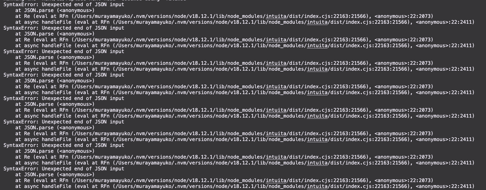

## Strong points

These are the features I found it convenient to use Intuita for migrating App Router
👍 Intuita updated folder structure to apply App Router
👍 Intuita updated `useRouter` source file
👍 Intuita automatically put `"use client"` directive when necessary

## Features nice to have

These are what I think can improve users' experience with this tool

- **js option**
  All converted files turned into' tsx' files now, and users need to manually update the file format to `jsx` if they don't use TypeScript. Although I agree TypeScript is the standard language over JavaScript, it would be great if we could have the language option to choose either JavaScript or TypeScript.
- **use component name for each file name**
  As a user, I don't think using `component` as a file name for components. Using the components' names for these files might be more practical.
- **deal with page router only hooks**
  Some hooks only available with Page Router such as `getServerSideProps`and `getStaticPaths`are still used in new files. (e.g. [app/user](./app/user/page.tsx), [app/shop/[category]/[productId]](app/shop/[category]/[productId]/page.tsx)). If we could replace these hooks with App Router way, that would be great. At least, it'd be helpful if we could get error messages.
- **deal with third party library imports**
  I found that new files forgot to import third-party libraries. (e.g.[app/user](./app/user/page.tsx)(`axios`), [app/shop/[category]/[productId]](app/shop/[category]/[productId]/page.tsx)(getSession)).

## Errors

I got these errors during the migration process.

## Environment

- node version: 18.12.1
